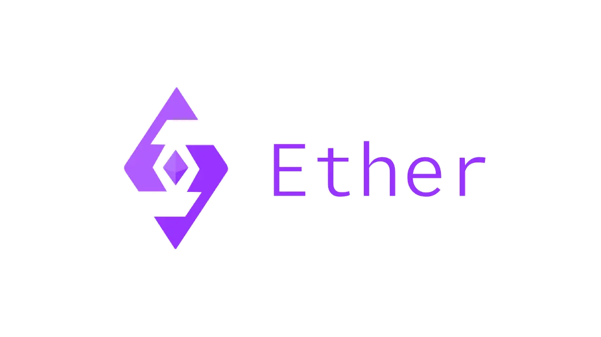
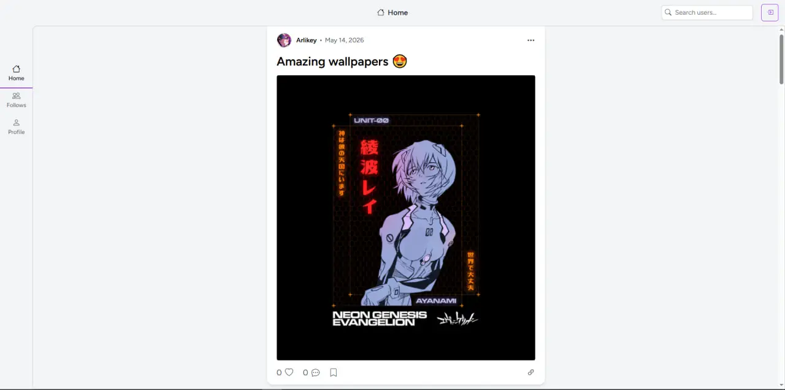
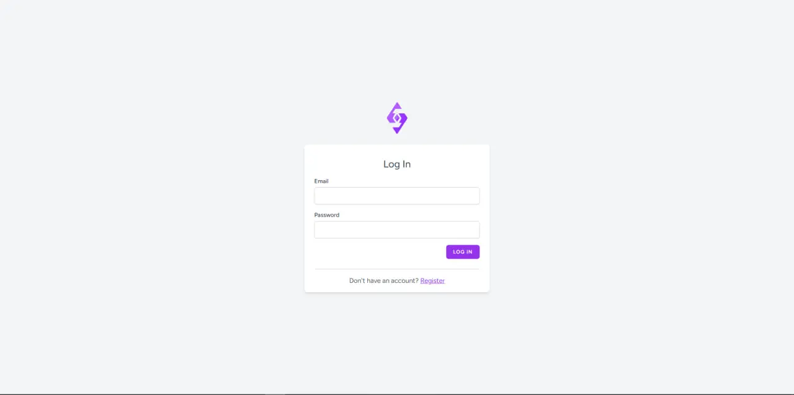
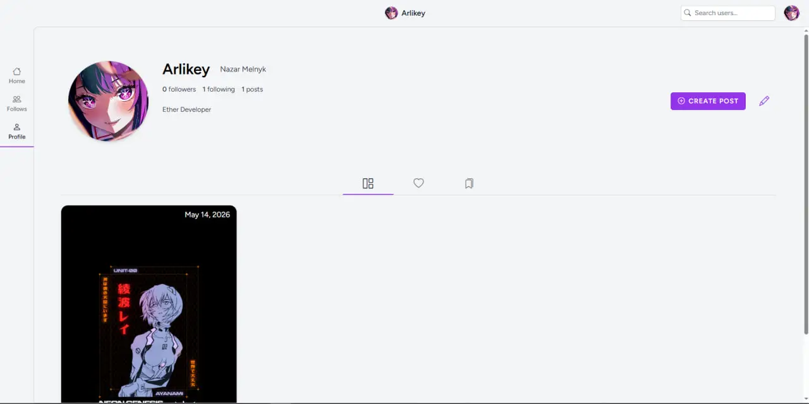
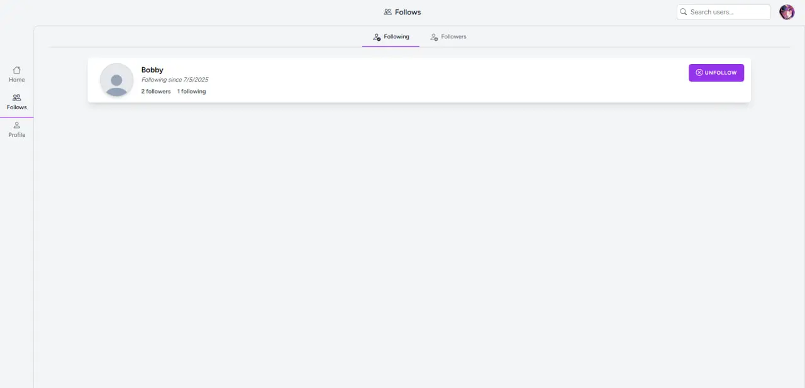

  

# Ether

Ether is a modern social media platform built to explore clean UI, fast interactions and scalable web architecture.

---

## ✨ About the Project

Ether is a social network platform where users can:
- Create posts with text and images
- Like and save posts
- Follow other users
- View personalized feeds
- Explore user profiles

The project focuses on UI/UX quality, performance and a scalable full-stack architecture.

---

## 🖥️ Features

- 🔐 Authentication (Login / Register)
- 🏠 Home feed with posts
- 👤 User profiles with posts, liked and saved tabs
- 👥 Followers / Following system
- ❤️ Like & Save functionality
- 🖼️ Image post support
- 📱 Responsive layout

---

## 📸 Screenshots

### Home

### Login

### Profile

### Follows

---

## 🧱 Tech Stack

- Frontend: React / Inertia.js / Tailwind CSS
- Backend: Laravel
- Database: PostgreSQL
- Auth: JWT